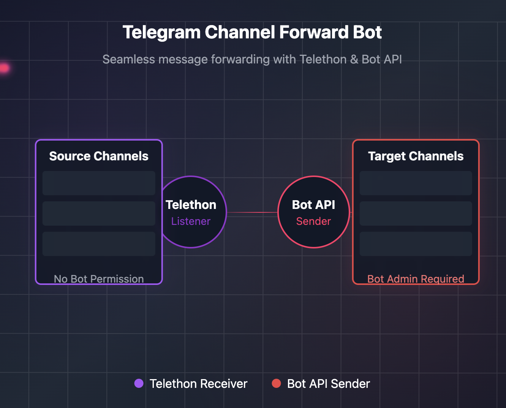

# TelegramForwarder 🚀

[](https://github.com/gentlemanhu/TelegramForwarder/blob/main/LICENSE)
[](https://www.python.org/downloads/)
[](https://core.telegram.org/bots/api)
[](https://github.com/psf/black)
[](https://github.com/gentlemanhu/TelegramForwarder/issues)
[](https://github.com/gentlemanhu/TelegramForwarder/stargazers)
[](https://github.com/gentlemanhu/TelegramForwarder/blob/main/CONTRIBUTING.md)
[](https://github.com/gentlemanhu/TelegramForwarder/commits/main)

TelegramForwarder is a powerful and user-friendly Telegram bot designed for automated message forwarding between channels. Built with Python, it offers an intuitive interface for managing channel content synchronization while supporting all types of media.

[English](#features) | [中文说明](#功能特点)


<div align="center">
  
</div>

## ✨ Features

- 🔄 Automated message forwarding between channels
- 📱 User-friendly inline keyboard interface
- 🔍 Monitor multiple source channels
- 📢 Forward to multiple target channels
- 📋 Channel pairing management
- 🖼️ Support for all media types (photos, videos, documents)
- 🔍 Content filtering with keyword and regex support
- ⏰ Time-based filtering for scheduled forwarding
- 📊 Media type filtering (photos, videos, audio, documents, etc.)
- 🌐 Multi-language support (English, Chinese, Russian, Ukrainian)
- 💾 SQLite database for persistent storage
- 🔒 Owner-only access control
- ⚡ Asynchronous processing for better performance

> **Note:** Some features like time-based filtering and media type filtering have not been fully tested yet.

## 📂 Directory Structure

The project has the following directory structure:

```
TelegramForwarder/
├── data/
│   ├── backups/     # Database backups
│   └── media_cache/ # Temporary media files
├── logs/          # Log files
└── ...
```

## 🚀 Quick Start

### Prerequisites

- Python 3.8 or higher
- Telegram Bot Token
- API ID and Hash from Telegram

### Installation

1. Clone the repository:
```bash
git clone https://github.com/gentlemanhu/TelegramForwarder.git
cd TelegramForwarder
```

2. Install dependencies:
```bash
pip install -r requirements.txt
```

3. Configure your environment variables:
```bash
cp .env.example .env
# Edit .env with your configuration
```

4. Run the bot:
```bash
python main.py
```

## 🔍 Filtering Features

TelegramForwarder offers powerful filtering capabilities to control which messages are forwarded:

### Content Filtering

- **Keyword Filtering**: Forward or block messages containing specific keywords
- **Regex Filtering**: Use regular expressions for advanced pattern matching
- **Whitelist/Blacklist Mode**: Choose whether to allow only matching messages or block matching messages

### Time-Based Filtering

- **Time Range**: Set specific time periods when messages should be forwarded
- **Day of Week**: Configure different forwarding schedules for different days
- **Allow/Block Mode**: Choose to either allow forwarding only during specified times or block forwarding during those times

### Media Type Filtering

- **Selective Media Forwarding**: Choose which types of media to forward (photos, videos, audio, documents, animations, stickers)
- **Text-Only Option**: Option to forward or block text-only messages
- **Per-Channel Pair Settings**: Configure different media filters for each source-destination channel pair

> **Note:** Time-based filtering and media type filtering features have not been fully tested yet.

## 🎁 Support the Project

If you find this project helpful, please consider supporting its development:

<div align="center">
  <table>
    <tr>
      <th>Digital Asset</th>
      <th>Address</th>
    </tr>
    <tr>
      <td> BTC</td>
      <td><code>1588hGJGh8WfeQNEydxEcurpPR8CaH9FCX</code></td>
    </tr>
    <tr>
      <td> USDT (TRC20)</td>
      <td><code>TY1A9McJd6wz1ZgfVHmLEoQGFJX27WSNoN</code></td>
    </tr>
    <tr>
      <td> ETH</td>
      <td><code>0x5aa791a5fe03f823275d7240ebe887d35fdf0f3b</code></td>
    </tr>
  </table>
</div>

## 🤝 Contributing

Contributions are welcome! Please feel free to submit a Pull Request. For major changes, please open an issue first to discuss what you would like to change.

## 📄 License

This project is licensed under the MIT License - see the [LICENSE](LICENSE) file for details.

---

# 中文说明

## 功能特点

- 🔄 自动转发频道消息
- 📱 友好的内联键盘界面
- 🔍 支持监控多个源频道
- 📢 支持转发到多个目标频道
- 📋 频道配对管理
- 🖼️ 支持所有媒体类型（图片、视频、文档）
- 🔍 内容过滤支持关键词和正则表达式
- ⏰ 基于时间的过滤功能，实现定时转发
- 📊 媒体类型过滤（图片、视频、音频、文档等）
- 🌐 多语言支持（英文、中文、俄文、乌克兰文）
- 💾 使用 SQLite 数据库持久化存储
- 🔒 仅限所有者访问控制
- ⚡ 异步处理提升性能

> **注意：** 部分功能如基于时间的过滤和媒体类型过滤尚未完全测试。

## 📂 目录结构

项目具有以下目录结构：

```
TelegramForwarder/
├── data/
│   ├── backups/     # 数据库备份
│   └── media_cache/ # 临时媒体文件
├── logs/          # 日志文件
└── ...
```

## 快速开始

### 前置要求

- Python 3.8 或更高版本
- Telegram Bot Token
- Telegram API ID 和 Hash

### 安装步骤

1. 克隆仓库：
```bash
git clone https://github.com/gentlemanhu/TelegramForwarder.git
cd TelegramForwarder
```

2. 安装依赖：
```bash
pip install -r requirements.txt
```

3. 配置环境变量：
```bash
cp .env.example .env
# 编辑 .env 文件，填入你的配置
```

4. 运行机器人：
```bash
python main.py
```

## 🔍 过滤功能

TelegramForwarder 提供了强大的过滤功能，可以控制转发哪些消息：

### 内容过滤

- **关键词过滤**：转发或拦截包含特定关键词的消息
- **正则表达式过滤**：使用正则表达式进行高级模式匹配
- **白名单/黑名单模式**：选择是只允许匹配的消息还是拦截匹配的消息

### 基于时间的过滤

- **时间范围**：设置应该转发消息的特定时间段
- **星期设置**：为不同的星期配置不同的转发计划
- **允许/拦截模式**：选择仅在指定时间内允许转发或在这些时间内拦截转发

### 媒体类型过滤

- **选择性媒体转发**：选择要转发的媒体类型（照片、视频、音频、文档、动画、贴纸）
- **纯文本选项**：选择转发或拦截纯文本消息
- **每对频道设置**：为每个源目标频道对配置不同的媒体过滤器

> **注意：** 基于时间的过滤和媒体类型过滤功能尚未完全测试。

## 🎁 支持项目

如果您觉得这个项目对您有帮助，欢迎支持项目的开发：

<div align="center">
  <table>
    <tr>
      <th>Digital Asset</th>
      <th>Address</th>
    </tr>
    <tr>
      <td> BTC</td>
      <td><code>1588hGJGh8WfeQNEydxEcurpPR8CaH9FCX</code></td>
    </tr>
    <tr>
      <td> USDT (TRC20)</td>
      <td><code>TY1A9McJd6wz1ZgfVHmLEoQGFJX27WSNoN</code></td>
    </tr>
    <tr>
      <td> ETH</td>
      <td><code>0x5aa791a5fe03f823275d7240ebe887d35fdf0f3b</code></td>
    </tr>
  </table>
</div>


---

If you find this project helpful, please consider giving it a star ⭐ to show your support!

如果这个项目对你有帮助，请考虑给它一个星标 ⭐ 以示支持！